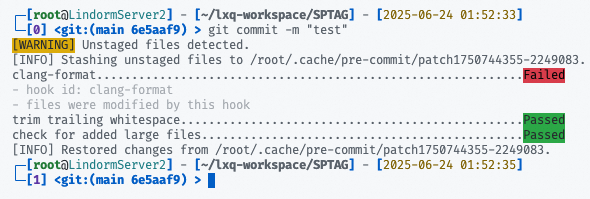
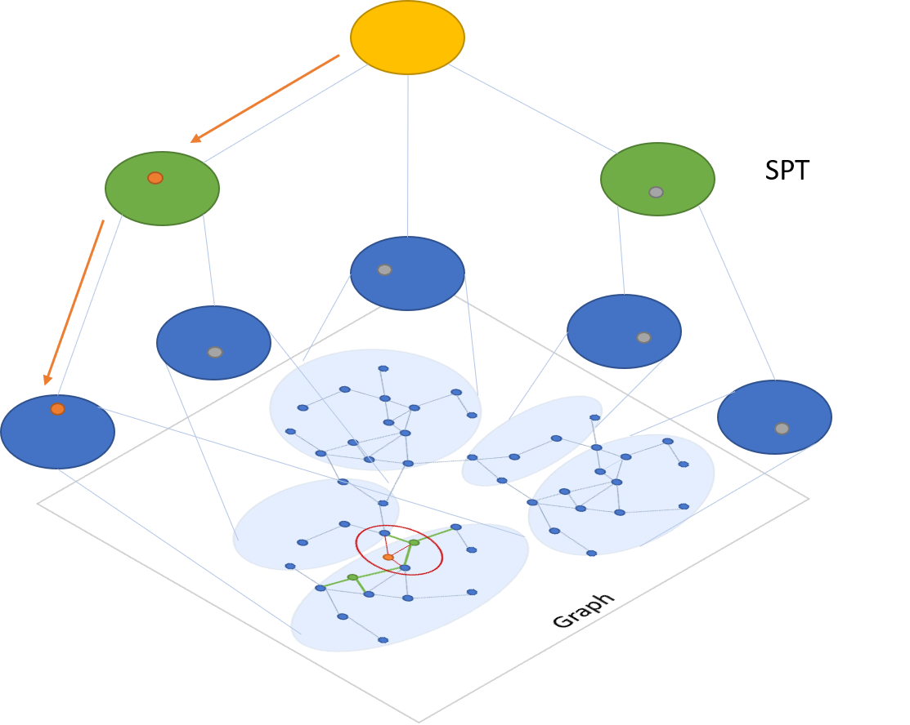

# SPMerge: An *enhanced* library for fast and robust approximate nearest neighbor search

## **SPMerge**

### Environment Setup

Clone the repository and set up the environment with the following commands:

```bash
git clone <repo-url>
cd <repo-directory>
./setup.sh
```
The setup script will install project dependencies and configure formatting tools. Please note that installing pre-commit hooks may take some time (maybe 1 minute).

With pre-commit tools enabled, commits containing unformatted files will not be allowed. Please ensure all files are formatted before committing.



### File Structure & Key Components

- The SPMerge assignment algorithm is implemented in the `Demo` directory. (Main entry point: [`Demo/MergerTest.cpp`](Demo/MergerTest.cpp))
- Additional modifications (such as file storage and helper functions) can be found throughout the SPANN source code.

### Configuration & Running Tests

1. **Preparing the Data**

   On the first run, generate the original SPANN index files using `ssdserving`. (3\~5min)

2. **Configuring Merger Section**

   Add the following section to your configuration files. Note that `LoadMergerResult` indicate whether to use the merger result files (e.g., `machine_0_index.bin`) when loading index in `ExtraFullGraphSearcher::LoadIndex`.

   ```ini
   [RedundancyMerger]
   # isExecute=true
   LoadMergerResult=false
   NumMachine=3
   SavePath="merger-result"
   IndexFileNameFormat="machine_%u_index.bin"
   PatchFileNameFormat="machine_%u_patch.bin"
   ```
   NOTE: check [spmerge-config-sift1m.ini](docs/spmerge-config-sift1m.ini) for more details.

3. **Running the Merger Test**

   Execute the merger test binary: `./merger-test`. (\~30s)

   This will read the original index files, collect cluster information, run the assignment algorithm, and output machine index/patch files.

4. **Serving With Merged Results**

   To use the merger result files for search serving:
   - Set `LoadMergerResult=true` in your config
   - Run `ssdserving` as usual. (\~1min)

   SPANN will now utilize the merged index files for search.

# SPTAG: A library for fast approximate nearest neighbor search

[](https://github.com/Microsoft/SPTAG/blob/master/LICENSE)
[](https://sysdnn.visualstudio.com/SPTAG/_build/latest?definitionId=2o

## **SPTAG**
 SPTAG (Space Partition Tree And Graph) is a library for large scale vector approximate nearest neighbor search scenario released by [Microsoft Research (MSR)](https://www.msra.cn/) and [Microsoft Bing](http://bing.com).

 <p align="center">
 
 </p>

## What's NEW
* Result Iterator with Relaxed Monotonicity Signal Support
* New Research Paper [SPFresh: Incremental In-Place Update for Billion-Scale Vector Search](https://dl.acm.org/doi/10.1145/3600006.3613166) - _published in SOSP 2023_
* New Research Paper [VBASE: Unifying Online Vector Similarity Search and Relational Queries via Relaxed Monotonicity](https://www.usenix.org/system/files/osdi23-zhang-qianxi_1.pdf) - _published in OSDI 2023_

## **Introduction**

This library assumes that the samples are represented as vectors and that the vectors can be compared by L2 distances or cosine distances.
Vectors returned for a query vector are the vectors that have smallest L2 distance or cosine distances with the query vector.

SPTAG provides two methods: kd-tree and relative neighborhood graph (SPTAG-KDT)
and balanced k-means tree and relative neighborhood graph (SPTAG-BKT).
SPTAG-KDT is advantageous in index building cost, and SPTAG-BKT is advantageous in search accuracy in very high-dimensional data.


## **How it works**

SPTAG is inspired by the NGS approach [[WangL12](#References)]. It contains two basic modules: index builder and searcher.
The RNG is built on the k-nearest neighborhood graph [[WangWZTG12](#References), [WangWJLZZH14](#References)]
for boosting the connectivity. Balanced k-means trees are used to replace kd-trees to avoid the inaccurate distance bound estimation in kd-trees for very high-dimensional vectors.
The search begins with the search in the space partition trees for
finding several seeds to start the search in the RNG.
The searches in the trees and the graph are iteratively conducted.

 ## **Highlights**
  * Fresh update: Support online vector deletion and insertion
  * Distributed serving: Search over multiple machines

 ## **Build**

### **Requirements**

* swig >= 4.0.2
* cmake >= 3.12.0
* boost >= 1.67.0

### **Fast clone**

```
set GIT_LFS_SKIP_SMUDGE=1
git clone --recurse-submodules https://github.com/microsoft/SPTAG

OR

git config --global filter.lfs.smudge "git-lfs smudge --skip -- %f"
git config --global filter.lfs.process "git-lfs filter-process --skip"
```

### **Install**

> For Linux:
```bash
mkdir build
cd build && cmake .. && make
```
It will generate a Release folder in the code directory which contains all the build targets.

> For Windows:
```bash
mkdir build
cd build && cmake -A x64 ..
```
It will generate a SPTAGLib.sln in the build directory.
Compiling the ALL_BUILD project in the Visual Studio (at least 2019) will generate a Release directory which contains all the build targets.

For detailed instructions on installing Windows binaries, please see [here](docs/WindowsInstallation.md)

> Using Docker:
```bash
docker build -t sptag .
```
Will build a docker container with binaries in `/app/Release/`.

### **Verify**

Run the SPTAGTest (or Test.exe) in the Release folder to verify all the tests have passed.

### **Usage**

The detailed usage can be found in [Get started](docs/GettingStart.md). There is also an end-to-end tutorial for building vector search online service using Python Wrapper in [Python Tutorial](docs/Tutorial.ipynb).
The detailed parameters tunning can be found in [Parameters](docs/Parameters.md).

## **References**
Please cite SPTAG in your publications if it helps your research:
```
@inproceedings{xu2023spfresh,
  title={SPFresh: Incremental In-Place Update for Billion-Scale Vector Search},
  author={Xu, Yuming and Liang, Hengyu and Li, Jin and Xu, Shuotao and Chen, Qi and Zhang, Qianxi and Li, Cheng and Yang, Ziyue and Yang, Fan and Yang, Yuqing and others},
  booktitle={Proceedings of the 29th Symposium on Operating Systems Principles},
  pages={545--561},
  year={2023}
}

@inproceedings{zhang2023vbase,
  title={$\{$VBASE$\}$: Unifying Online Vector Similarity Search and Relational Queries via Relaxed Monotonicity},
  author={Zhang, Qianxi and Xu, Shuotao and Chen, Qi and Sui, Guoxin and Xie, Jiadong and Cai, Zhizhen and Chen, Yaoqi and He, Yinxuan and Yang, Yuqing and Yang, Fan and others},
  booktitle={17th USENIX Symposium on Operating Systems Design and Implementation (OSDI 23)},
  year={2023}
}

@inproceedings{ChenW21,
  author = {Qi Chen and
            Bing Zhao and
            Haidong Wang and
            Mingqin Li and
            Chuanjie Liu and
            Zengzhong Li and
            Mao Yang and
            Jingdong Wang},
  title = {SPANN: Highly-efficient Billion-scale Approximate Nearest Neighbor Search},
  booktitle = {35th Conference on Neural Information Processing Systems (NeurIPS 2021)},
  year = {2021}
}

@manual{ChenW18,
  author    = {Qi Chen and
               Haidong Wang and
               Mingqin Li and
               Gang Ren and
               Scarlett Li and
               Jeffery Zhu and
               Jason Li and
               Chuanjie Liu and
               Lintao Zhang and
               Jingdong Wang},
  title     = {SPTAG: A library for fast approximate nearest neighbor search},
  url       = {https://github.com/Microsoft/SPTAG},
  year      = {2018}
}

@inproceedings{WangL12,
  author    = {Jingdong Wang and
               Shipeng Li},
  title     = {Query-driven iterated neighborhood graph search for large scale indexing},
  booktitle = {ACM Multimedia 2012},
  pages     = {179--188},
  year      = {2012}
}

@inproceedings{WangWZTGL12,
  author    = {Jing Wang and
               Jingdong Wang and
               Gang Zeng and
               Zhuowen Tu and
               Rui Gan and
               Shipeng Li},
  title     = {Scalable k-NN graph construction for visual descriptors},
  booktitle = {CVPR 2012},
  pages     = {1106--1113},
  year      = {2012}
}

@article{WangWJLZZH14,
  author    = {Jingdong Wang and
               Naiyan Wang and
               You Jia and
               Jian Li and
               Gang Zeng and
               Hongbin Zha and
               Xian{-}Sheng Hua},
  title     = {Trinary-Projection Trees for Approximate Nearest Neighbor Search},
  journal   = {{IEEE} Trans. Pattern Anal. Mach. Intell.},
  volume    = {36},
  number    = {2},
  pages     = {388--403},
  year      = {2014
}
```

## **Contribute**

This project welcomes contributions and suggestions from all the users.

We use [GitHub issues](https://github.com/Microsoft/SPTAG/issues) for tracking suggestions and bugs.

## **License**
The entire codebase is under [MIT license](https://github.com/Microsoft/SPTAG/blob/master/LICENSE)
